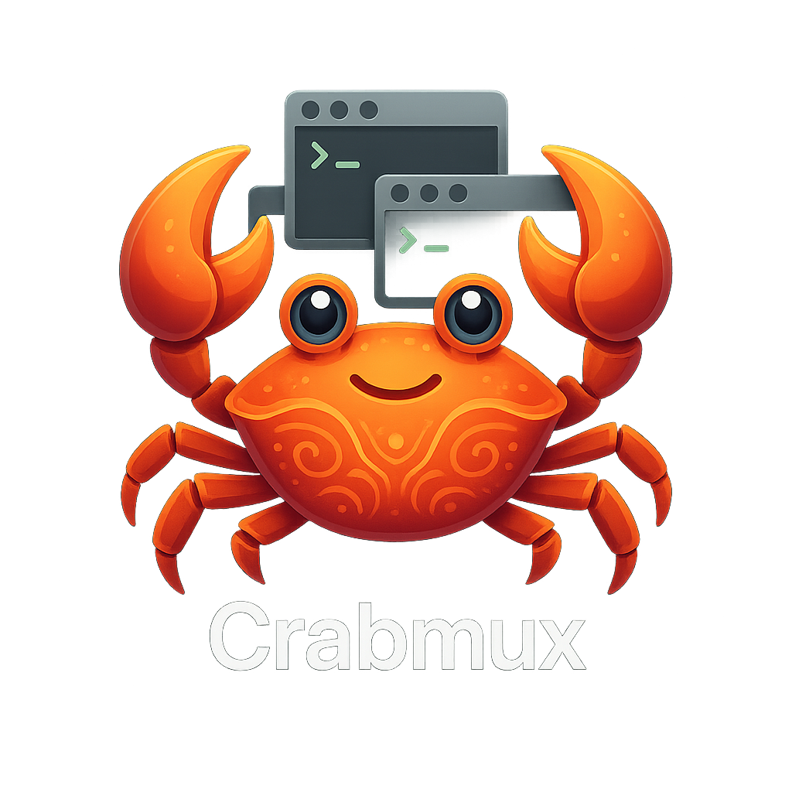

# crabmux 🦀



A mobile-friendly tmux session manager with an interactive TUI, designed for quick navigation with minimal keypresses.

## Features

- **Interactive TUI**: Navigate sessions with arrow keys
- **Quick Commands**: Single-letter shortcuts for common operations
- **Mobile-Optimized**: Perfect for SSH sessions on phones via Blink Shell
- **Session Management**: Create, attach, kill, rename sessions
- **Smart Features**: Session aliases, restore from snapshots, bulk operations
- **Live Overview**: Real-time session monitoring

## Installation

### Prerequisites

crabmux requires tmux to be installed on your system. 

```bash
# macOS
brew install tmux

# Ubuntu/Debian
sudo apt-get install tmux

# Fedora
sudo dnf install tmux

# Arch
sudo pacman -S tmux
```

### From Source

```bash
# Clone the repository
git clone https://github.com/madhavajay/crabmux.git
cd crabmux

# Build and install
cargo build --release
sudo cp target/release/cmux /usr/local/bin/

# Or install directly with cargo
cargo install --path .
```

### Quick Install (One-liner)

```bash
curl -sSL https://raw.githubusercontent.com/madhavajay/crabmux/main/install.sh | bash
```

This will automatically:
- Detect your OS and architecture
- Download the appropriate binary
- Install to your system PATH
- Verify the installation

### Manual Install (macOS/Linux/Windows)

Download the latest release for your platform:

```bash
# Auto-detect platform and install
curl -L https://github.com/yourusername/crabmux/releases/latest/download/cmux-$(uname -s | tr '[:upper:]' '[:lower:]')-$(uname -m) -o cmux
chmod +x cmux
sudo mv cmux /usr/local/bin/
```

### Install with Cargo

```bash
cargo install crabmux
```

## Usage

### Interactive Mode (Default)

Simply run `cmux` to enter the interactive TUI:

```bash
cmux
```

**TUI Controls:**
- `↑/↓` or `j/k`: Navigate sessions
- `Enter`: Attach to selected session
- `n`: Create new session
- `K`: Kill selected session
- `r`: Refresh session list
- `q`: Quit

### Command Mode

```bash
# List sessions
cmux ls

# Attach to session
cmux a <session-name>

# Create new session
cmux n <session-name>

# Kill session
cmux k <session-name>

# Rename session
cmux r <old-name> <new-name>
```

### Advanced Commands

```bash
# Show live session overview
cmux top

# Get detailed session info
cmux info <session-name>

# Create session alias
cmux alias work=myproject-session

# Restore sessions from snapshot
cmux restore ~/.config/crabmux/snapshots/work.json

# Kill all sessions (with confirmation)
cmux kill-all
# or use the short alias
cmux ka

# Show version information
cmux version
# or use the short alias
cmux v
```

## Mobile Usage Tips

1. **Quick Access**: Add alias to your shell config:
   ```bash
   alias t='cmux'
   ```

2. **Blink Shell**: Works perfectly with Blink Shell on iOS:
   - Large touch targets in TUI mode
   - Single-key operations
   - Clear visual indicators

3. **Session Aliases**: Create shortcuts for frequently used sessions:
   ```bash
   cmux alias w=work
   cmux alias p=personal
   # Then just: cmux a w
   ```

4. **VibeTunnel Integration**: Works perfectly with [VibeTunnel](https://vibetunnel.sh/) for secure mobile SSH access:
   - Set up VibeTunnel for persistent SSH connections
   - Use crabmux to manage tmux sessions over VibeTunnel
   - Perfect combination for mobile development workflows

## Configuration

Config and snapshots are stored in:
- Linux/macOS: `~/.config/crabmux/`
- Windows: `%APPDATA%\crabmux\`

### Example Snapshot Format

```json
{
  "sessions": [
    {
      "name": "work",
      "windows": [
        {
          "name": "editor",
          "path": "~/projects/myapp"
        },
        {
          "name": "server",
          "path": "~/projects/myapp",
          "command": "npm run dev"
        }
      ]
    }
  ]
}
```

## Building from Source

Requirements:
- Rust 1.70+
- tmux installed

```bash
cargo build --release
```

## License

MIT

## Contributing

Pull requests welcome! Please ensure:
- Code follows Rust conventions
- Tests pass (`cargo test`)
- Format with `cargo fmt`